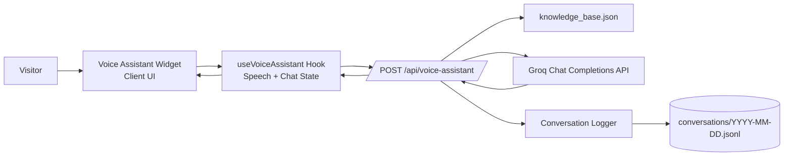

# Architecture

This document explains the high-level architecture of the portfolio application and the voice assistant flow.

## System Overview

## Layer Breakdown

### 1. UI Layer

- Location: `src/components`
- The assistant widget handles user interaction, mic toggle, and speech status rendering.
- Animations are implemented with Framer Motion for listening and speaking states.

### 2. Client Logic Layer

- Location: `src/hooks/useVoiceAssistant.ts`
- Responsibilities:
  - Capture speech input and convert it into user messages.
  - Maintain in-memory conversation state.
  - Send requests to `POST /api/voice-assistant`.
  - Handle rate-limit responses and retry hints.
  - Play LLM responses with speech synthesis.

### 3. API Layer

- Location: `src/app/api/voice-assistant/route.ts`
- Runtime: `nodejs`
- Responsibilities:
  - Validate incoming `messages` payload.
  - Build and prepend a server-side system prompt.
  - Call Groq chat completions API.
  - Return structured response to the client.
  - Trigger asynchronous conversation logging.

### 4. Data Layer

- Knowledge source: `src/data/knowledge_base.json`
- Conversation logs: `conversations/YYYY-MM-DD.jsonl`

## Voice Assistant Request Lifecycle

1. User speaks in the widget.
2. Hook builds/updates chat messages.
3. Hook sends `POST /api/voice-assistant` with recent messages.
4. API route injects system prompt from the knowledge base.
5. API route calls Groq and gets completion text.
6. API route responds with `content`, `rateLimited`, and `retryAfterSeconds`.
7. API route asynchronously logs only:
   - user prompt
   - LLM response
8. Hook updates UI and triggers text-to-speech playback.

## Logging Behavior

- Logging module: `src/lib/conversationLogger.ts`
- File backend: `src/lib/storage/fileLogger.ts`
- Each JSONL line stores:
  - `prompt`
  - `response`
- Logging is best-effort and non-blocking; request flow continues even if log write fails.

## Reliability and Limits

- Rate-limit parsing supports `Retry-After` header and fallback parsing from provider error text.
- System prompt and knowledge base live server-side and are not exposed raw to users.
- Message history is trimmed client-side before API calls to reduce token usage.

## Related Docs

- API contract: `docs/api.md`
- Conversation logging schema: `docs/conversation-logging.md`
